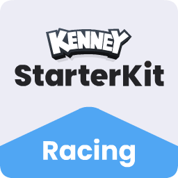

<p align="center"></p>

# weBump Racing Demo

A small, playable Godot game that shows how to use the **weBump Connected Games
API**: people you bump in real life become your racing rivals, and a replay
they chose to share races you as a ghost. Think StreetPass, in your own game.

**Play it:** [webump.app/demo](https://webump.app/demo) ·
**Read the API docs:** [developer.webump.app](https://developer.webump.app)

| Docs | What it covers |
| --- | --- |
| [Racing tutorial series](https://developer.webump.app/racing.html) | Seven lessons from local mock race to your own live project, with a downloadable host |
| [Get started](https://developer.webump.app/tutorial) | Apply for a project, OAuth with PKCE, private saves, visitor handoffs |
| [Share selected game data](https://developer.webump.app/tutorial#shared-data) | The `game.shared` flow this demo uses for replays |
| [API reference](https://developer.webump.app/reference) | Every endpoint, error code and limit (OpenAPI) |
| [Connect button](https://developer.webump.app/brand) | The official control and assets used on the title screen |
| [Project lifecycle](https://developer.webump.app/lifecycle) | Review, permissions changes, suspension and data export |
| [Changelog](https://developer.webump.app/changelog) | Platform changes |

## What the demo does with the API

Game-facing API calls live in [`scripts/webump_api.gd`](scripts/webump_api.gd),
a single autoload. On the hosted web demo, the shared browser SDK owns the
connection and sends the result through the checked export-shell bridge.
Game screens call the autoload’s functions and listen to its signals.

| Step | Endpoint | Scope | In this repo |
| --- | --- | --- | --- |
| Connect (reviewed public-client methods) | `GET /oauth/authorize` or `POST /oauth/device_authorization`, then `POST /oauth/token` | `profile.basic` | `connect_player()` → hosted browser helper or direct device flow; refresh in `_ensure_fresh_token()` |
| Read the player's name and color | `GET /v1/me` | `profile.basic` | `fetch_player_profile()` → nameplate and paint |
| Private save (never visible to others) | `GET /v1/me/state`, `PUT /v1/me/state/:key` | `game.state` | `racing_save`, `ghost_telemetry` |
| Public high score on bump cards / profile | `PUT /v1/me/capsule`, `PUT /v1/me/showcase` | `game.capsule`, `game.showcase` | `save_public_highscore()` |
| Share one replay, on purpose | `PUT /v1/me/shared` (`{"publish":true,…}`) | `game.shared` | **Share Replay** button on the results card |
| Rivals from real bumps | `GET /v1/me/visitors`, `…/:ref/shared` | `visitors.receive` + `game.shared` | `load_visitors()` after connecting and every 45 s on the title screen → `RivalRoster` |
| Disconnect | `POST /oauth/revoke` | — | `disconnect_player()` |

Privacy rules the demo follows, and that you should too:

- Tokens live in memory only. Public identifiers (`client_id`, API origin,
  callback) are in [`config.json`](config.json); nothing secret ships in the export.
- A rival's replay is never read from their private state. Each player publishes
  one replay through `game.shared` after pressing a button; the server also
  requires their own "Share selected game data" toggle in the weBump app.
- `410` on a shared-document read means that data is unavailable. An authorized
  basic card can use AI instead; if the card itself is unavailable, drop its
  personal data and use a practice driver.
- Every write sends `If-Match` with the latest revision. A `409` is surfaced,
  never retried blindly; the local save is always kept.

The reviewed shared-data schema for this game is
[`docs/shared_data_definition.json`](docs/shared_data_definition.json).
[`docs/API_INTEGRATION.md`](docs/API_INTEGRATION.md) documents the replay
contract, the web callback relay, and revision handling in detail.

## Run it locally

Open `project.godot` in **Godot 4.7** and press **F5**. No account is needed:
inside the editor the API runs in **mock mode**, which simulates a connected
profile and races you against Maya's synthetic ghost plus Liam and Sam. Every
export talks to the real API.

| Controls | Action |
| --- | --- |
| W / Up | Accelerate |
| S / Down | Brake / reverse |
| A, D / Left, Right | Steer |

Three laps with ordered checkpoints. Outside the editor you must connect with
weBump before racing: the three rival slots are filled from your real bumps
(valid ghosts first, so one shared replay replaces one practice driver), and
the rest are practice AI. The synthetic Maya/Liam/Sam cards exist only in the
editor's mock mode. Ghost times are **Recorded**,
finished AI times are **Finished**, unfinished AI times are projected from
observed pace. Personal bests and complete replays (≤ 3 minutes, ≤ 256 frames,
≤ 12 KB) save locally first; connected saves sync to weBump afterwards.

## Code map

| File | Responsibility |
| --- | --- |
| `scripts/webump_api.gd` | Session, transport, saves, shared replay, visitors |
| `scripts/webump_connect_button.gd` | Official connect control (see the brand page) |
| `scripts/title_screen.gd` | Car chooser, connect, automatic visitor refresh, start |
| `scripts/rival_roster.gd` | Turn visitor cards into a bounded race roster |
| `scripts/ghost_data.gd` | Replay validation, compaction, shared document |
| `scripts/ghost_recorder.gd` | Record runs, keep the best, share on request |
| `scripts/ghost_driver.gd` | Replay a recording on the race clock |
| `scripts/ai_vehicle.gd` | Waypoint driver, laps, finish effects |
| `scripts/race_manager.gd`, `race_standings.gd` | Countdown, roster, checkpoints, results |
| `scripts/race_hud.gd` | HUD, results card, Share Replay |
| `scripts/vehicle.gd`, `car_presets.gd` | Vehicle physics, paint and model presets |
| `web/shell.html` | Web export shell with the origin-checked host connection bridge |

Rival and ghost vehicles inherit `scenes/vehicle.tscn` so geometry, sounds,
nameplates and effects are set up once in the scene files.

## Web export and hosting

The `Web` preset is single-threaded and uses `web/shell.html`. Export from the
editor or, after installing matching Godot export templates:

```sh
mkdir -p build/web
godot --headless --path . --export-release Web build/web/index.html
```

`build/` is gitignored. The complete export is published on `gh-pages` and
embedded by [webump.app/demo](https://webump.app/demo). On that host, the shared
browser helper selects callback + PKCE on iPhone/iPad and device approval on a
computer. Same-phone approval opens the registered callback, which relays the
result to the original tab and says “Go back to your game”; it never loads a
second game. Keep the original tab open in the same browser. No matching code
is required for that callback flow.

Device approval displays a QR/short code, requires comparison and approval in
weBump on the player's iPhone, and polls with a private device credential.
Direct local/GitHub Pages exports and native demo builds without the host bridge
also use this reviewed method. `/oauth/pending` is status-only; it never returns
a callback, authorization code or token. Tokens stay in memory.

For your own game, follow [lesson 3](https://developer.webump.app/racing-connect.html)
and use the [static host example](https://developer.webump.app/sdk/godot-host.zip).
Configure your own approved client/callback/scopes in both game and host, change
`HOST_ORIGIN` in the export shell, and rebuild. No developer backend or shared
project API key is required. Public-client OAuth permits an explicitly approved
local copy; it does not attest an official game binary.

## Verify

```sh
godot --headless --path . --editor --import --quit
godot --headless --path . --script tests/test_racing.gd
godot --headless --path . --script tests/test_api.gd
godot --headless --path . --script tests/test_loading.gd
godot --headless --fixed-fps 60 --path . --script tests/test_race_simulation.gd
godot --headless --fixed-fps 60 --path . --script tests/test_ghost_sharing.gd
```

## Credits and license

Built on [Kenney's Starter Kit Racing](https://github.com/KenneyNL/Starter-Kit-Racing)
(CC0 assets and starter code) with the [Godot Engine](https://godotengine.org).
This demo keeps the same license; see [LICENSE](LICENSE). weBump and its API are
not affiliated with Kenney.
